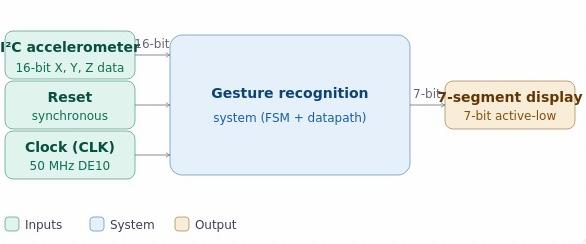
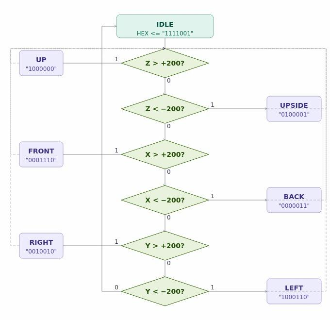
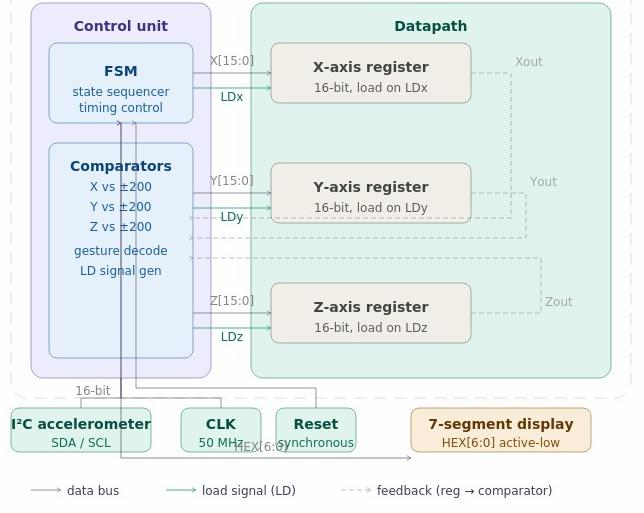
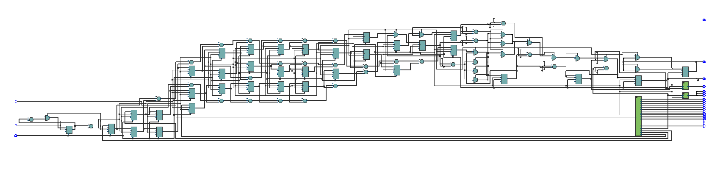

# Gesture Recognition — HPS-Integrated Orientation & Pitch/Roll Detection System

A real-time orientation and gesture recognition system built on the **DE10-Standard board**,
integrating an ARM Hard Processor System (HPS) with custom VHDL hardware on the FPGA fabric.
The system reads 3D acceleration data from an ADXL345 sensor and translates it into
human-readable orientation states (UP, DOWN, LEFT, RIGHT, FRONT, BACK) and live pitch/roll
angles displayed on the board's 7-segment displays.

> Built for ENGI 9865: Advanced Digital Systems, Memorial University of Newfoundland (Winter 2026).  
> Instructor: Dr. Hamed Nasiri

---

## Demo

[](https://www.youtube.com/watch?v=Djtrw1_TBx8)

*Click to watch the live demo — board orientation driving real-time HEX display output.*

---

## What it does

The ADXL345 accelerometer is hardwired to the HPS. As the board tilts, gravitational pull
shifts across the X, Y, Z axes (range: −2g to +2g, scale factor 3.9 mg/LSB). The system:

1. **HPS (C)** — reads raw X/Y/Z axis data from the ADXL345 over I2C, computes pitch and
   roll using `atan2()`, and writes integer angles to the FPGA via the HPS-to-FPGA bridge
2. **FPGA (VHDL)** — samples the incoming data over 8 cycles, averages it, applies
   threshold-based gesture logic, and drives the HEX displays with orientation state and
   live angle values

**Why `atan2` and not `sin/cos`?** Sine values are very sparse near 90° (sin(80°) ≈ 0.99),
making it hard to distinguish angles in that region. `tan` gives better resolution:

```
pitch = atan2(x, z)
roll  = atan2(y, z)
```

---

## System Architecture



The design splits cleanly into two domains:

| Domain | Technology | Responsibility |
|---|---|---|
| HPS | ARM Cortex-A9, C | I2C data acquisition, trigonometric processing, bridge writes |
| FPGA | VHDL, Cyclone V | Gesture state machine, BCD conversion, 7-segment display |

---

## Gesture Detection Logic

The FPGA samples HPS register data every 0.05s, averages 8 samples, then evaluates
against a threshold of **200 LSB (≈ 0.78g)**:

| Input Condition | Detected Orientation | VHDL Output |
|---|---|---|
| Z > 200 | Upright / Flat | `"UP"` |
| Z < −200 | Inverted | `"DO"` |
| X > 200 | Tilted Right | `"RI"` |
| X < −200 | Tilted Left | `"LE"` |
| Y > 200 | Tilted Front | `"FR"` |
| Y < −200 | Tilted Back | `"BA"` |
| Default | Idle / Undetermined | `"ID"` |



---

## VHDL Modules

| File | Description |
|---|---|
| `axis.vhd` | Threshold-based gesture state machine — evaluates 16-bit signed X/Y/Z vectors against orientation constants |
| `HPS.vhd` | Sync logic for receiving data from the HPS-to-FPGA bridge |
| `seg_7_ang.vhd` | BCD conversion for displaying pitch/roll angles on HEX displays with flicker-free slow clock refresh |
| `seg_7.vhd` | Decoder mapping orientation strings to physical HEX display pins |

---

## Datapath



---

## Synthesis

Synthesized in **Quartus Prime** targeting the **Cyclone V** device on the DE10-Standard.



**Key synthesis decision:** floating-point `atan2` was offloaded entirely to the HPS ARM
core rather than implemented in VHDL — this avoided the "Can't fit design" error (Error
11802) that occurs when synthesizing floating-point math onto the FPGA fabric, while
keeping FPGA resource usage minimal and deterministic.

---

## Repository Structure

```
gesture-recognition-de10/
├── src/
│   ├── axis.vhd
│   ├── HPS.vhd
│   ├── seg_7_ang.vhd
│   └── seg_7.vhd
├── hps/
│   └── main.c                  ← HPS C code (I2C read, atan2, bridge write)
├── tb/
│   └── gesture_tb.vhd          ← Self-checking ModelSim testbench
├── docs/
│   ├── top_level_io.png
│   ├── datapath.png
│   ├── asm_chart.png
│   ├── rtl_view.png
│   └── waveform_sim.png
└── README.md
```

---

## How to Synthesize (Quartus)

1. Open Quartus Prime → **New Project** → target device: `5CSXFC6D6F31C6` (DE10-Standard)
2. Add all files from `src/` and `hps/`
3. Assign pins using the DE10-Standard pin assignment file
4. **Processing → Start Compilation**
5. Program the board via **Tools → Programmer**

---

## Potential Applications

- Sign language recognition
- Drone / UAV attitude control
- Accessibility input devices
- Wearable gesture interfaces

---

## Tools Used

VHDL · C · ModelSim · Quartus Prime · DE10-Standard (Cyclone V) · ADXL345 · I2C · HPS-to-FPGA Bridge · Platform Designer

---

## Authors

| Name | Contributions |
|---|---|
| **Avijit Hazra** | Platform Designer bridge, gesture logic & ASM chart design, Makefile configuration, VHDL implementation, DE10 synthesis, report, presentation |
| Onwukanjo Innocent O. | Initial top-level design, Platform Designer bridge, HPS C-code, report, presentation |

---

## License

MIT
